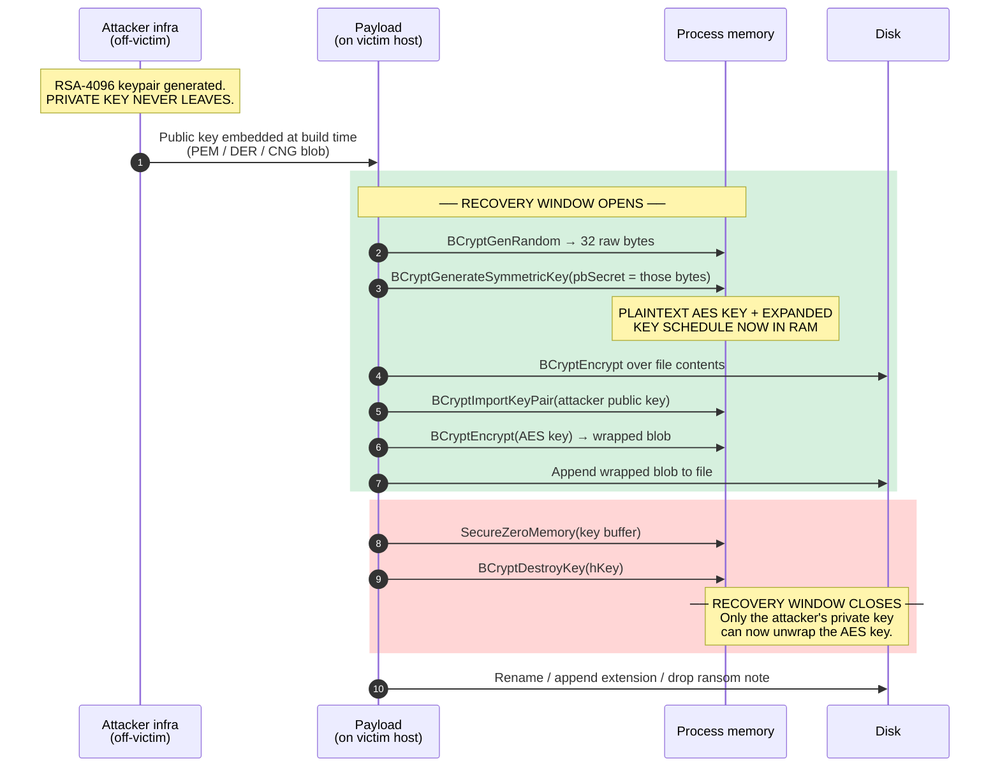

# Module 02 — The Hybrid Encryption Model


> The scheme that makes ransomware work, and the four-minute window in which it doesn't.

**Prerequisites:** [Module 00](../00-Foundations/) (entropy, hashing vs encryption) and [Module 01](../01-Symmetric-Cryptography/) (AES modes, ChaCha20, recognizing both in a binary).

---

## Module scope

| This module teaches | This module does not contain |
|---|---|
| Why the hybrid scheme is used and what it costs the attacker | An encryptor implementation |
| The CNG and CAPI call sequences, and how to recognize them | File traversal or target-selection logic |
| Where the wrapped key sits on disk and how to find it | Anti-recovery or backup-tampering code |
| Where the plaintext key sits in RAM and how to recover it | Evasion or throughput-optimization techniques |
| How to give a client an evidence-backed recoverability verdict | |

The omissions are deliberate. See [SCOPE.md](../SCOPE.md).

---

## 1. The layman version

You have a heavy safe full of documents. You want to lock it so only you can open it later.

**A padlock (symmetric / AES)** is fast. Slam it shut, done. The problem: whoever locks it must hold the key, and if the key stays taped to the safe, anyone can open it.

**A mail slot (asymmetric / RSA)** solves that. Anyone can push something through the slot. Only the person holding the box key can take it out. But you cannot push a filing cabinet through a mail slot. The slot is tiny and slow.

So the attacker does both:

1. Padlock the documents. Fast, works on any volume of data.
2. Drop the padlock's key through *their* mail slot, sealing it in an envelope only they can open.
3. Staple the sealed envelope to the outside of the safe.
4. Burn their copy of the padlock key.

The result is the sentence that defines every ransomware incident:

> **The locked file and the key that opens it are both sitting on your disk. Neither does you any good, because the envelope holding that key can only be opened by a private key that was never on your network.**

The attacker gets asymmetric security at symmetric speed. That is the whole trick. It is also exactly how TLS and PGP work — the cryptography here is not evil or exotic, it is textbook. Only the intent is different.

---

## 2. Why they can't just use RSA

New analysts often ask why ransomware bothers with AES at all. Two hard constraints:

**Constraint 1 — RSA has a tiny payload.** An RSA operation cannot encrypt more data than its modulus, minus padding. With OAEP-SHA256:

| Key size | Modulus | Max plaintext per operation |
|---|---|---|
| RSA-2048 | 256 bytes | 190 bytes |
| RSA-4096 | 512 bytes | **446 bytes** |

To encrypt a 10 GB VM disk with RSA-4096 alone you would need roughly 24 million separate RSA operations.

**Constraint 2 — RSA is slow, AES is not.** Modern x86-64 CPUs implement AES in hardware via the AES-NI instruction set (`AESENC`, `AESKEYGENASSIST`). The gap is about four orders of magnitude:

| Operation | Rough throughput |
|---|---|
| AES-256-CBC with AES-NI | 1–5 GB/s per core |
| ChaCha20 (software) | 1–3 GB/s per core |
| RSA-4096 encryption | ~10,000 ops/sec (≈4 MB/s at 446 bytes each) |

That 10 GB disk: seconds with AES, days with RSA. Ransomware is a race against detection and response. It cannot afford days.

So the symmetric cipher does the bulk work, and RSA is used exactly once per key — to wrap a 32-byte AES key, which fits comfortably inside the 446-byte budget.

> **Note on "RSA-4048":** this appears in a lot of ransom notes and secondhand writeups. It is not a real key size. RSA moduli in use are 1024, 2048, 3072, and 4096 bits. If a note claims 4048, either the operator made a typo or is bluffing — both are worth recording as an attribution signal.

---

## 3. Anatomy of an encrypted file

Where the wrapped key gets stored is a family fingerprint. Four common layouts:

```
FOOTER  (most common)
┌──────────────────────────────────────────────┬─────────┬──────────┐
│ ciphertext body                              │ wrapped │ metadata │
│ (AES-CBC / AES-GCM / ChaCha20)               │  key    │  + magic │
└──────────────────────────────────────────────┴─────────┴──────────┘
                                                 256/512B   variable
                                                            ← EOF

HEADER  (survives truncation; breaks file-type detection immediately)
┌─────────┬──────────┬─────────────────────────────────────────────┐
│ wrapped │ IV/nonce │ ciphertext body                             │
│  key    │          │                                             │
└─────────┴──────────┴─────────────────────────────────────────────┘

SIDECAR  (one key file per encrypted file, or one per directory)
  invoice.xlsx.locked      ← ciphertext only
  invoice.xlsx.locked.key  ← wrapped key

SESSION KEY  (one key for the whole host; blob dropped once)
  every file encrypted with the same symmetric key
  single wrapped blob in the ransom note or a dedicated file
```

**Why you care:** the *session key* layout is the single most important thing to identify early. If one symmetric key encrypted every file on the host, then recovering that one key from RAM recovers **everything**. Per-file keys mean recovering one key recovers one file. This changes the entire response strategy, and you can often determine it in minutes by checking whether the wrapped blobs on several files are byte-identical.

```bash
# Are the footers identical across files? If yes → session key → one recovery unlocks all.
for f in *.locked; do tail -c 512 "$f" | sha256sum | cut -d' ' -f1; done | sort -u | wc -l
# result "1"  → single session key, high-value recovery target
# result "N"  → per-file keys
```

---

## 4. The scheme end to end



Steps 3 through 9 are the green band. That is where the plaintext key exists on a machine you control.

**Everything in Module 06 exists to exploit that band.** Every hour you spend arguing about whether to pull memory is an hour that band stays closed.

---

## 5. The Windows API surface

### Cryptography Next Generation (CNG) — modern families

This is the call sequence you will see in an API monitor trace. Read it top to bottom; each line is a recognition anchor.

```
BCryptOpenAlgorithmProvider(&hAes, L"AES", NULL, 0)
BCryptSetProperty(hAes, L"ChainingMode", L"ChainingModeCBC", ...)
BCryptGenRandom(NULL, keyBuf, 32, BCRYPT_USE_SYSTEM_PREFERRED_RNG)   ◄── KEY IS BORN HERE
BCryptGenerateSymmetricKey(hAes, &hKey, obj, objLen, keyBuf, 32, 0)  ◄── PLAINTEXT KEY IN pbSecret
BCryptEncrypt(hKey, plaintext, len, NULL, iv, 16, out, outLen, &n, BCRYPT_BLOCK_PADDING)
BCryptOpenAlgorithmProvider(&hRsa, L"RSA", NULL, 0)
BCryptImportKeyPair(hRsa, NULL, L"RSAPUBLICBLOB", &hPub, blob, blobLen, 0)  ◄── ATTACKER KEY
BCryptEncrypt(hPub, keyBuf, 32, &oaep, NULL, 0, wrapped, 512, &n, BCRYPT_PAD_OAEP)  ◄── THE WRAP
SecureZeroMemory(keyBuf, 32)                                          ◄── WINDOW CLOSES
BCryptDestroyKey(hKey)
```

| API | Role in the scheme | Why the defender cares |
|---|---|---|
| `BCryptOpenAlgorithmProvider` | Selects the algorithm | The `L"AES"` / `L"RSA"` / `L"ChaCha20"` wide strings are YARA-able |
| `BCryptGenRandom` | Produces raw key bytes | If a family uses a weak RNG *instead* of this, a decryptor becomes possible |
| `BCryptGenerateSymmetricKey` | Loads the key into a handle | **`pbSecret` is the plaintext key.** Breakpoint here and you have it |
| `BCryptSetProperty` | Sets chaining mode | Tells you CBC vs GCM vs CTR before you ever look at ciphertext |
| `BCryptEncrypt` | Bulk encryption, and the RSA wrap | Called with two different handle types; distinguish by which |
| `BCryptImportKeyPair` | Loads the attacker's public key | The blob passed in **is the embedded public key**. Dump it |
| `BCryptExportKey` | Serializes a key to a blob | Produces `KDBM` magic; a serialized symmetric key may hit disk |
| `SecureZeroMemory` | Destroys the plaintext key | Its presence tells you the author thought about forensics |

### CryptoAPI (CAPI) — legacy families, WannaCry era

Still worth knowing; you will meet it in older samples and in case studies.

| CAPI call | CNG equivalent | Note |
|---|---|---|
| `CryptAcquireContextW(..., PROV_RSA_AES, ...)` | `BCryptOpenAlgorithmProvider` | `MS_ENH_RSA_AES_PROV` string is a strong indicator |
| `CryptGenKey(hProv, CALG_AES_256, ...)` | `BCryptGenerateSymmetricKey` | Key stays inside the CSP, not in a caller buffer |
| `CryptImportKey` | `BCryptImportKeyPair` | Loads the attacker public key blob |
| `CryptEncrypt` | `BCryptEncrypt` | Bulk work |
| **`CryptExportKey(hSessionKey, hPubKey, SIMPLEBLOB, ...)`** | `BCryptEncrypt` with the public key | **This single call *is* the key wrap in CAPI.** Learn to spot it |

`CryptExportKey` with a non-NULL second argument is the CAPI hybrid-encryption tell. The session key is exported *encrypted under* the public key handle you pass. If you see that call in a disassembly, you are looking at a hybrid scheme, full stop.

### When there are no imports at all

BlackCat/ALPHV (Rust) and other modern families statically link their crypto. There is no `bcrypt.dll` in the IAT and no helpful API names. Pivot to constant hunting — covered in [Module 01](../01-Symmetric-Cryptography/):

| Constant | Bytes | Indicates |
|---|---|---|
| AES S-box first row | `63 7C 77 7B F2 6B 6F C5` | AES, any implementation |
| AES-NI instructions | `AESENC`, `AESKEYGENASSIST` opcodes | Hardware AES |
| ChaCha/Salsa sigma | `"expand 32-byte k"` → `61707865 3320646E 79622D32 6B206574` | ChaCha20 or Salsa20 |
| SHA-256 round constants | `428A2F98 71374491 ...` | SHA-256, often inside a KDF |

---

## 6. Recovering the key from memory

### Why AES keys are findable

AES does not use your 32-byte key directly. It runs a **key expansion** first, producing a round-key schedule held in contiguous memory for the lifetime of the encryption:

| Variant | Rounds | Schedule size in RAM |
|---|---|---|
| AES-128 | 10 | 176 bytes |
| AES-192 | 12 | 208 bytes |
| AES-256 | 14 | **240 bytes** |

That schedule is not random. Each 16-byte round key is a deterministic function of the previous one. A scanner can walk memory, assume each 240-byte window is a schedule, run the expansion backwards, and check whether the relation holds. False positives are essentially impossible — random data does not satisfy the AES key schedule recurrence.

**This is why an AES key cannot hide in a memory image.** It is a 240-byte structure with a mathematically verifiable shape.

### Acquisition doctrine

> **Capture RAM before anything else. Do not reboot. Do not shut down. Do not "isolate by pulling the power."**

Network-isolate by pulling the *cable* or via an EDR containment action that leaves the host running. Then acquire memory. A running host mid-encryption is the most valuable evidence in the entire incident, and it is destroyed by exactly the reflex most IT teams have.

### Workflow

```bash
# 1. Acquire (WinPmem, Magnet RAM Capture, or EDR memory acquisition)
winpmem.exe -o victim.raw

# 2. Identify the encryptor process
python3 vol.py -f victim.raw windows.pslist
python3 vol.py -f victim.raw windows.malfind          # injected / RWX regions

# 3. Dump that process's memory
python3 vol.py -f victim.raw -o ./dump windows.memmap --pid 4812 --dump

# 4. Scan the dump for verifiable AES key schedules
findaes ./dump/pid.4812.dmp
bulk_extractor -E aes -o ./bulk ./dump/pid.4812.dmp

# 5. Test each candidate against a file whose plaintext you know
#    (a default OS file, or a document you have in backup)
```

Step 5 is the part people skip. `findaes` will hand you multiple candidates — Windows itself uses AES constantly for TLS, BitLocker, and DPAPI. You must **validate** by decrypting a file with known plaintext. See [`labs/03-decrypt-harness/`](../07-Memory-Forensics/).

### Caveats, honestly stated

- **ChaCha20 has no expanded key schedule.** Its 32-byte key sits in a 64-byte state block alongside the `expand 32-byte k` constant, a counter, and a nonce. You hunt the sigma constant and take the following 32 bytes as a candidate. Far noisier than AES recovery.
- **Per-file keys mean one recovered key = one recovered file.** Confirm the layout first (Section 3).
- **A well-written encryptor zeroes keys promptly.** You may recover only the key for the file being encrypted at the moment of capture, or nothing.
- **Recovery from memory is the exception, not the plan.** It works often enough to always attempt and never often enough to promise a client.

---

## 7. Lab — footer triage

[`labs/parse_footer.py`](labs/parse_footer.py) profiles an encrypted file: entropy structure, encryption paradigm, and wrapped-key footer candidates. Stdlib only, read-only, never modifies the target.

> **Need files to practise on?** Do not use live ransomware for this. Generate safe specimens instead:
> ```bash
> python3 ../01-Symmetric-Cryptography/labs/encryption_demo.py specimens --outdir ./lab-samples
> ```
> That produces full, intermittent, and header-only specimens plus the untouched original, so you can check your triage calls against ground truth. [Module 01 labs](../01-Symmetric-Cryptography/labs/) also walks through what encryption does to data byte by byte, which is worth doing first if the entropy numbers below still feel abstract.

```bash
python3 labs/parse_footer.py /evidence/invoice.xlsx.akira
```

```
========================================================================
FILE     /evidence/invoice.xlsx.akira
SIZE     41,040 bytes
ENTROPY  7.071 / 8.000   (normalized 0.884)
------------------------------------------------------------------------
VERDICT  INTERMITTENT ENCRYPTION (candidate)   [confidence: medium]
         6 encrypted bands, 5 plaintext bands; 5/11 blocks (45%) may be
         recoverable plaintext

ENTROPY PROFILE (4096-byte blocks, first 11 shown)
  █▅█▅█▅█▅█▅█
  low ▁▁▁ plaintext / structured      high ███ ciphertext

FOOTER BLOB CANDIDATES
  [STRONG] last 256 bytes  norm-entropy 1.004  body 16-byte aligned
           -> RSA-2048 wrapped key
========================================================================
```

Two findings from one command: this file was **intermittently encrypted**, so roughly 45% of it survived as plaintext and is a partial-recovery candidate; and the key was wrapped with **RSA-2048**, not RSA-4096, which is an attribution datapoint.

**Settling the footer size definitively.** Any suffix of a random footer also looks random, so smaller sizes always co-flag. Compare against a known-good copy from backup or an unaffected host:

```bash
python3 labs/parse_footer.py invoice.xlsx.akira --original /backup/invoice.xlsx
```
```
SIZE DELTA vs ORIGINAL  (definitive footer sizing)
  original   40,600 bytes
  encrypted  40,864 bytes
  overhead      264 bytes
     if RSA-2048 wrapped key: 8 bytes of other overhead
```

264 bytes of overhead = a 256-byte RSA-2048 wrapped key plus 8 bytes of AES block padding (40,600 mod 16 = 8). The scheme is now fully characterized without ever touching the sample.

> **High entropy is not the same as secure.** AES-ECB scores about 6.7 on the specimen in [Module 01](../01-Symmetric-Cryptography/labs/) and leaks the file's structure completely. If you ever see repeating 16-byte blocks in a ciphertext body, you have found ECB, and repeated ciphertext maps directly to repeated plaintext.

> **A note on entropy normalization.** The tool scores entropy against *measured* random-data behaviour at each sample size, not against 8.0. A 128-byte block of perfect ciphertext scores about 6.55, not 8.0 — 128 samples cannot populate 256 symbols. Judging small blobs against 8.0 makes real ciphertext look non-random and you discard the finding. This trips up a lot of people.

---

## 8. Detection content

### YARA — hybrid crypto call profile

```yara
rule Hybrid_Crypto_CNG_Profile
{
    meta:
        author      = "Evil-Encryption-Academy"
        description = "PE importing the CNG call set typical of a hybrid encryption scheme"
        reference   = "02-Hybrid-Encryption-Model"
        note        = "TRIAGE AID, NOT A VERDICT. Legitimate software uses these APIs."

    strings:
        $sym1 = "BCryptGenerateSymmetricKey" ascii
        $sym2 = "BCryptGenRandom"            ascii
        $sym3 = "BCryptEncrypt"              ascii
        $asy1 = "BCryptImportKeyPair"        ascii
        $asy2 = "BCryptExportKey"            ascii
        $alg1 = "ChainingModeCBC"            wide
        $alg2 = "ChainingModeGCM"            wide
        $alg3 = "RSAPUBLICBLOB"              wide

    condition:
        uint16(0) == 0x5A4D
        and 2 of ($sym*)      // bulk symmetric encryption
        and 1 of ($asy*)      // plus an asymmetric key operation
        and 1 of ($alg*)      // plus explicit mode/blob selection
}

rule Embedded_Asymmetric_Public_Key_In_PE
{
    meta:
        description = "Public key material embedded in a PE - the hybrid scheme's build-time artifact"
        reference   = "02-Hybrid-Encryption-Model"

    strings:
        $pem_spki = "-----BEGIN PUBLIC KEY-----"     ascii
        $pem_pkcs1 = "-----BEGIN RSA PUBLIC KEY-----" ascii
        $cng_rsa1 = { 52 53 41 31 }   // "RSA1" BCRYPT_RSAPUBLIC_MAGIC / CAPI PUBLICKEYBLOB
        $cng_eck1 = { 45 43 4B 31 }   // "ECK1" BCRYPT_ECDH_PUBLIC_P256_MAGIC
        $der_oid  = { 2A 86 48 86 F7 0D 01 01 01 }  // rsaEncryption 1.2.840.113549.1.1.1

    condition:
        uint16(0) == 0x5A4D and any of them
}
```

Both rules are **triage aids**. Chrome, Office, and every VPN client will match the first one. Use them to prioritize a queue, never to convict a binary.

### Behavioral detection

The crypto itself is not anomalous — the *pattern of file access around it* is. High-value signals:

| Signal | Source | Why it works |
|---|---|---|
| One process opening thousands of files across many extensions in minutes | Sysmon 11, Security 4663 | No legitimate process behaves this way |
| Mass rename events with a uniform new extension | `$UsnJrnl:$J` (`RENAME_NEW_NAME`) | Survives even when logs are cleared |
| Sharp entropy rise in files a single process wrote | File integrity monitoring | Direct evidence of encryption |
| Backup/shadow-copy tooling invoked by a non-admin-workflow parent | Security 4688, Sysmon 1 | Anti-recovery precedes encryption |
| Kernel driver service created shortly before mass file I/O | System 7045 | BYOVD staging |
| Audit log cleared | Security 1102 | Cleanup; correlate with the surrounding gap |

`$UsnJrnl:$J` is the highest-value artifact in the list. It records every rename on the volume with a timestamp, so it reconstructs the encryption timeline even when the event log is gone. Covered in [Module 08](../09-Triage-and-IR/).

---

## 9. Exercises

1. **Layout identification.** Given ten encrypted files from one incident, determine whether the family uses per-file or session keys. Justify with the hash comparison from Section 3.
2. **Paradigm call.** Run `parse_footer.py` on a set of files. Which were fully encrypted and which intermittently? What percentage of each file is recoverable plaintext?
3. **Key sizing.** Using `--original` against known-good copies, determine the wrapped key size and account for every byte of overhead.
4. **API tracing.** In a safe VM, run a sample under an API monitor. Produce the call trace from Section 5 and identify the exact call where the plaintext key is visible.
5. **Memory recovery.** Snapshot a VM mid-encryption, acquire RAM, and recover a candidate AES key. Validate it against a file with known plaintext. Document how many false candidates you had to reject.
6. **Write the verdict.** In one page, in language a CFO understands, state what is and is not recoverable and why. This is the deliverable that actually matters.

---

## 10. References

**Primary**
- Microsoft Security Blog — [ransomware coverage](https://www.microsoft.com/en-us/security/blog/search/?s=ransomware) (MSTIC family writeups)
- CISA [#StopRansomware advisories](https://www.cisa.gov/stopransomware) — per-family technical detail and IOCs
- Microsoft Docs — CNG reference (`BCrypt*`, `NCrypt*`) and legacy CryptoAPI reference

**Technique**
- *The Art of Memory Forensics* — Ligh, Case, Levy, Walters. Chapters on process memory acquisition.
- *Practical Malware Analysis* — Sikorski & Honig. Ch. 13 covers encoding and crypto identification.
- *Serious Cryptography* — Aumasson. Ch. 1–10 for the cryptography underneath all of this.
- [13cubed](https://www.13cubed.com/) — `$UsnJrnl` and `$MFT` analysis, memory forensics walkthroughs
- SANS **FOR610** (reversing), **FOR508** (IR and memory), **FOR500** (Windows artifacts)

**Tools**
- Volatility 3 · WinPmem · `findaes` · `bulk_extractor` · Ghidra · x64dbg

---

| ◄ [Module 01: Symmetric Cryptography](../01-Symmetric-Cryptography/) | [Module 03: Encryption Paradigms](../03-Encryption-Paradigms/) ► |
|---|---|
