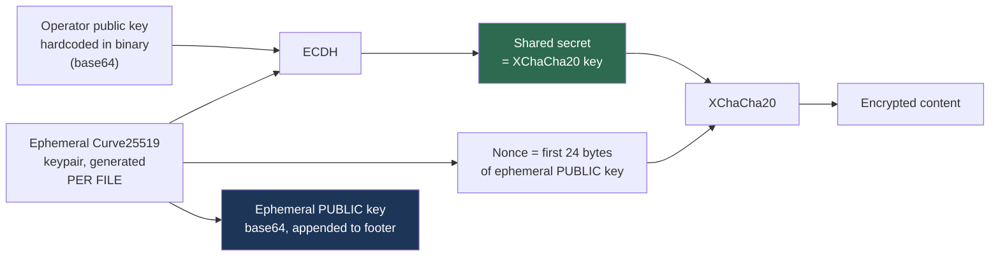

# Case Study — The Gentlemen (Storm-2697)


> The reference case for per-file ephemeral ECDH, and for why entropy-only triage misses modern footers.

**Primary source:** Microsoft Threat Intelligence, [The Gentlemen ransomware: Dissecting a self-propagating Go encryptor](https://www.microsoft.com/en-us/security/blog/2026/05/28/the-gentlemen-ransomware-dissecting-a-self-propagating-go-encryptor/) (28 May 2026). Everything below is sourced from that analysis. Corroborating work by Cybereason and Trend Micro is credited there.

---

## Why this case is in the curriculum

Three reasons, each mapping to a module:

1. **Its cryptography is the current state of the art** and closes the weaknesses older families had. Module 02's hybrid model in its strongest form.
2. **Its footer defeats entropy-only triage.** The key material is base64 text, which scores too low to look like ciphertext. This drove a real fix to `parse_footer.py`.
3. **It is a Go binary obfuscated with Garble**, so there is no useful import table. Module 08's constant-hunting case.

---

## 1. Operator and model

<cite index="20-1">Microsoft tracks the operators as Storm-2697, a financially motivated actor running the RaaS platform while affiliates carry out attacks. The Gentlemen emerged around mid-2025 as a closed group before opening to affiliates in September 2025, and later established a partnership with the BreachForums marketplace to recruit penetration testers and initial access brokers.</cite> <cite index="20-1">The operators use double extortion, exfiltrating data alongside encryption to pressure victims with the threat of publication.</cite>

<cite index="20-1">Microsoft has observed impact across education, transportation, healthcare, and financial organizations in North America, South America, Europe, Africa, and Asia.</cite>

---

## 2. The cryptographic scheme

<cite index="20-1">The encryptor combines Curve25519 elliptic-curve cryptography with the XChaCha20 stream cipher for per-file encryption.</cite> For each file:

<cite index="20-1">It generates a unique ephemeral Curve25519 key pair, computes the ECDH shared secret between the ephemeral private key and the operator's embedded public key, uses that shared secret as the XChaCha20 key, derives the nonce from the first 24 bytes of the ephemeral public key, encrypts the file contents, and appends the base64-encoded ephemeral public key to the footer so the key can be reconstructed at decryption time.</cite>



<cite index="20-1">At decryption the operator uses their Curve25519 private key with the stored ephemeral public key to reconstruct the shared secret and recover the XChaCha20 key; the nonce is recomputed deterministically from the first 24 bytes of that public key, so no separate nonce field is needed.</cite>

<cite index="20-1">Microsoft notes the design ensures each file uses a distinct key and nonce, eliminating any possibility of key or nonce reuse across files.</cite>

### What this closes off

| Historical weakness | Status here |
|---|---|
| Key reuse across files | Eliminated. Per-file ephemeral keypair |
| Nonce/IV reuse | Eliminated. Nonce is derived per file |
| Weak RNG producing predictable keys | Would require a flaw in ephemeral keypair generation |
| Recovering one key unlocks everything | No. One key recovers one file |
| Wrapped key blob is sensitive | It is a **public** key. Harmless on its own |

**The recovery implication is blunt.** There is no cryptographic shortcut. Recovery requires the operator's private key, the shared secret while it is still in memory, or the surviving plaintext in partially encrypted files. The Module 02 memory window is the only technical avenue, and it yields one file per recovered secret.

---

## 3. Partial encryption, and the recovery opportunity

<cite index="20-1">Files of 1 MB or less are fully encrypted. Larger files get three chunks encrypted at distributed offsets: one at the start, one near the midpoint, and one toward the end, which corrupts file structure while dramatically reducing encryption time.</cite>

<cite index="20-1">Each chunk is processed in 64 KB blocks, and to keep the chunks cryptographically separate the last byte of the 24-byte nonce is XORed with the chunk index, so a fresh cipher instance runs per chunk and no keystream is reused across regions of the file.</cite>

The operator chooses the aggressiveness at runtime:

| Mode | Per chunk | Total encrypted | **Plaintext surviving** |
|---|---|---|---|
| default | 9% | ~27% | ~73% |
| `--fast` | 3% | ~9% | ~91% |
| `--superfast` | 1% | ~3% | ~97% |
| `--ultrafast` | 0.3% | ~0.9% | **~99%** |

<cite index="20-1">The speed flags only affect files larger than 1 MB; smaller files are fully encrypted regardless.</cite>

> **This table is the most commercially important thing in this case study.** In `--ultrafast` mode roughly 99% of every large file survives as plaintext. Databases, VM disks, mail stores, and archives are exactly the large files these modes target. Structure-aware carving and format-specific repair can recover very substantial content with no key at all. Determining which mode was used is therefore an early, high-value triage task — and the footer records it.

---

## 4. The footer, and why it broke our tooling

<cite index="20-1">The footer contains the base64-encoded ephemeral public key after an `--eph--` delimiter, a `GENTLEMEN` marker after `--marker--` for identification, and, on large files only, a speed flag marker telling the decryptor which chunking percentage was used. Its absence on small files implicitly signals full encryption.</cite>

Running our own triage tool against a reconstructed specimen exposed a genuine blind spot:

```
FOOTER BLOB CANDIDATES
  [weak]   last 512 bytes  norm-entropy 0.995  -> RSA-4096 wrapped key     ← WRONG
```

The tool reported spurious RSA candidates and missed the real footer completely. **Base64 uses 64 symbols and scores around 6.0 bits per byte**, far below any ciphertext threshold, so an entropy-driven tail scan is structurally incapable of seeing it. The bogus hits were just the tail of the final encrypted chunk.

After adding text-footer detection:

```
VERDICT  DISTRIBUTED-CHUNK PARTIAL ENCRYPTION (candidate)
         encrypted at head, midpoint and tail; 168/231 blocks (73%) look like
         surviving plaintext - strong partial-recovery candidate

TEXT-ENCODED FOOTER  <-- entropy triage cannot see this
  delimiter '--eph--' at -70 from EOF
  base64 blob: 44 chars -> 32 bytes at -63 from EOF
      -> X25519/Curve25519 public key or a raw 256-bit symmetric key
```

**The transferable lesson: always string-scan the tail as well as measuring its entropy.** Entropy answers "is this random", not "is this meaningful". A base64 key blob is meaningful and not random.

---

## 5. Analysis notes

<cite index="20-1">The encryptor is written in Go and obfuscated with Garble, targeting Windows.</cite> Practical consequences:

- No meaningful import table. Constant scanning is the primary route (`tools/identify_crypto.py`).
- The sigma constant `expand 32-byte k` will hit, but **it cannot distinguish XChaCha20 from ChaCha20**. Confirm via the 24-byte nonce.
- Garble mangles names and strips package paths, so expect no helpful symbols.

<cite index="20-1">Execution requires a build-specific password argument validated against a hardcoded value, which Microsoft notes is a static comparison that can be identified and bypassed through static analysis.</cite> For a lab, that means a recovered sample may be detonatable — treat any such binary as live and follow `labs/SAFE_LAB_SETUP.md` without exception.

<cite index="20-1">Encrypted files are renamed with the appended extension `.umc16h`, and a ransom note named README-GENTLEMEN.txt is dropped in each scanned directory.</cite>

---

## 6. Detection and response

The encryption itself is not the detection surface; the surrounding behavior is. Per MSTIC, the encryptor <cite index="20-1">deletes volume shadow copies using both vssadmin and wmic, clears the System, Application, and Security event logs with wevtutil, removes prefetch files and RDP logs, and deletes PowerShell command history from all user profiles.</cite> <cite index="20-1">It also disables Defender real-time monitoring and adds exclusions for itself and the entire C:\ volume.</cite>

<cite index="20-1">It establishes persistence through scheduled tasks (UpdateSystem in the SYSTEM context and UpdateUser in the signed-in user's context) and registry Run values (GupdateS under HKLM and GupdateU under HKCU).</cite>

<cite index="20-1">Its self-propagation module attempts 21 remote execution operations per target host across multiple APIs and privilege levels, and each method is attempted regardless of whether earlier ones failed.</cite> <cite index="20-1">Microsoft's guidance notes that a single successful execution on one additional host is enough for propagation to continue.</cite>

**Response implications for a DFIR lead:**

- **Assume log destruction.** With Security, System, and Application cleared and PowerShell history deleted, pivot to artifacts that resist clearing: `$MFT`, `$UsnJrnl:$J`, and any forwarded or SIEM-side copies. This is precisely why Windows Event Forwarding matters.
- **Scope for lateral movement immediately.** Given a redundant propagation model, treating this as a single-host incident will understate the blast radius.
- **Record the encryption mode early.** It determines how much data is recoverable without a key.

MSTIC's recommended mitigations include <cite index="20-1">enabling tamper protection to prevent security services being stopped, turning on controlled folder access, running EDR in block mode, and enabling the attack surface reduction rule that blocks process creations originating from PsExec and WMI commands.</cite> The tamper protection and ASR points map directly onto the behaviors above.

Full IOCs, Defender detections, and advanced hunting queries are in the source article and are not reproduced here — go to the primary source, which is maintained.

---

## 7. Exercises

1. Reconstruct a specimen for each speed mode and run `parse_footer.py`. At which percentage does distributed-chunk detection stop working, and why?
2. Given ~99% surviving plaintext in `--ultrafast` mode, plan a recovery approach for a corrupted SQL backup file. Which parts of the format are damaged, and does that matter?
3. The nonce derives from the ephemeral public key, which is stored in the clear. Explain why this is safe here, and what would break if the same nonce derivation were used with a *fixed* keypair.
4. Write the client-facing recoverability paragraph for a victim whose file server was hit in default mode. Be accurate about what is and is not recoverable.

---

## 8. References

- **Primary:** [MSTIC — The Gentlemen ransomware](https://www.microsoft.com/en-us/security/blog/2026/05/28/the-gentlemen-ransomware-dissecting-a-self-propagating-go-encryptor/), 28 May 2026
- Cybereason and Trend Micro prior analyses, credited in the MSTIC acknowledgements
- Related modules: [02 Hybrid Encryption](../../02-Hybrid-Encryption-Model/) · [03 Paradigms](../../03-Encryption-Paradigms/) · [10 Recovery](../../10-Recovery-and-Decryption/)
