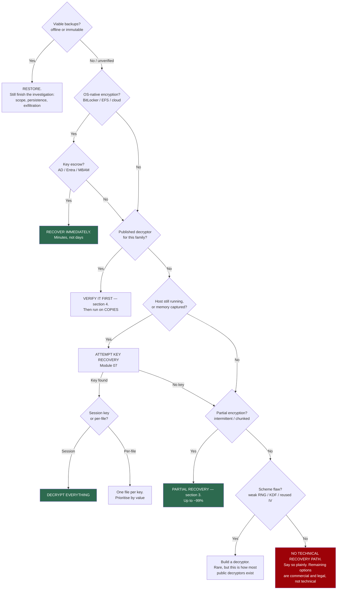

# Module 10 — Recovery and Decryption


> The only module the victim actually cares about.

**Prerequisites:** [Module 02](../02-Hybrid-Encryption-Model/) (why it's locked), [Module 03](../03-Encryption-Paradigms/) (paradigms), [Module 07](../07-Memory-Forensics/) (key recovery).

---

## 1. Answer the question that was asked

Everything else in this repository is instrumental. The client asked one question:

> **"Are we getting our data back?"**

Your job is a defensible, evidence-backed answer — not a hopeful one and not a hedge. "It's encrypted with AES so it's gone" is a failure, because it is frequently wrong. So is "we'll get it all back," because it usually isn't true either.

**Work the tree below in order. It is ordered by expected value, not by technical interest.** Memory forensics is the exciting branch; key escrow and backups recover far more data in practice.

---

## 2. The recoverability decision tree



**Do not skip to the interesting branch.** The most common expensive mistake in ransomware IR is a team running memory forensics while nobody has checked whether recovery keys were escrowed in Active Directory.

---

## 3. Partial recovery — the underused branch

Fast encryption modes are chosen to destroy file *structure* at minimum I/O cost. They are not chosen to destroy data. That distinction is worth a great deal of money.

Per MSTIC's analysis of The Gentlemen:

| Mode | Encrypted | **Surviving plaintext** |
|---|---|---|
| default | ~27% | ~73% |
| `--fast` | ~9% | ~91% |
| `--superfast` | ~3% | ~97% |
| `--ultrafast` | ~0.9% | **~99%** |

Those modes apply only to files over 1 MB — meaning databases, mail stores, VM disks, and archives. Exactly the assets that matter most.

### The tool

[`labs/recover_partial.py`](labs/recover_partial.py) maps encrypted regions by entropy, refines the boundaries, and extracts what survived. Against a 21 MB SQL database hit in `--ultrafast` mode:

```
REGION MAP
  █······························██······························█
  █ encrypted    · surviving plaintext

  encrypted         189,580 bytes  (  0.9%)
  RECOVERABLE    20,864,000 bytes  ( 99.1%)
  runs                    2   largest 10,463,488 bytes

FORMAT: SQL MDF   OUTLOOK: MODERATE
```

The recovered content is directly readable:

```
INSERT INTO customers VALUES (730,'ACME Industrial','48200.00','UNPAID','2024-04-17');
INSERT INTO customers VALUES (731,'ACME Industrial','48200.00','UNPAID','2024-04-17');
```

### Preserve offsets. This is the part people get wrong.

```bash
python3 labs/recover_partial.py locked.mdf --footer 70 --out recovered.mdf
```

`--out` writes an image where **encrypted regions are nulled, not removed.** Every surviving byte stays at its original offset.

That matters because most structured formats are **offset-addressed** — internal pointers reference absolute positions. PST message tables, MDF page pointers, VMDK grain tables, PDF xref entries. Null the damage and every surviving pointer still resolves, so repair tools can parse the file. Concatenate the good fragments instead and you shift everything after the first gap, breaking every pointer that follows.

Use `--fragments` only for formats with no global structure: flat text, logs, CSV.

### How well formats survive

| Format | Outlook | Why |
|---|---|---|
| Text, CSV, logs, SQL dumps | **Excellent** | No structure to break. Every surviving byte is usable |
| PST / OST | **Good** | Record-structured and offset-addressed. Run `scanpst` after nulling |
| VMDK / VHD | **Good** | Guest filesystem is largely independent; carve from inside it |
| SQL MDF | **Moderate** | 8 KB pages parse individually. Expect ATTACH to fail — use a page-level extractor |
| PDF | **Moderate** | Objects rebuildable by scanning for `obj` markers even without an xref |
| ZIP / OOXML | **Poor–moderate** | Central directory lives at the END. Carve members via `PK\x03\x04` headers |
| JPEG | **Poor** | Entropy-coded and sequentially dependent; early damage corrupts everything after |
| MP4 / MOV | **Varies** | Entirely depends on whether the `moov` atom survived |

**Determine the encryption mode early.** It sets the ceiling on this entire branch, and the footer often records it.

---

## 4. Verifying a decryptor before you run it

Never run a downloaded decryptor against the only copy of client data.

1. **Source it properly.** [No More Ransom](https://www.nomoreransom.org/) or the vendor directly. Never a forum link or a search-ad result. Fake decryptors exist and some are themselves ransomware.
2. **Hash it** and check against the vendor's published value.
3. **Scan and detonate it in an isolated VM first** ([`labs/SAFE_LAB_SETUP.md`](../labs/SAFE_LAB_SETUP.md)).
4. **Test on copies of a few low-value files.** Verify with `parse_footer.py` — a correct decryption produces an intact format header.
5. **Only then run at scale, still on copies.** Keep the encrypted originals until recovery is signed off. They are your only retry.

> "We ran the tool and it ate the last good copy" is a real and career-defining failure mode. The encrypted files are evidence *and* your fallback. Never operate on them directly.

---

## 5. Scheme flaws — rare, but this is where public decryptors come from

Almost every published decryptor exists because of an implementation bug, not a break in the cipher. Worth checking:

- **Weak key derivation.** Key derived from a timestamp, PID, hostname, or other low-entropy seed rather than a CSPRNG. Look for the KDF's *input* — that is the highest-value question in the sample.
- **Reused IV or nonce** across files, enabling keystream recovery against stream ciphers.
- **Key retained on disk** in a temp file, a registry value, or the ransom note itself.
- **Flawed RNG seeding.** The classic case is seeding from `time()`, which narrows the key space to something searchable.
- **ECB mode.** Repeating ciphertext blocks map to repeating plaintext.

`identify_crypto.py` flags KDF presence for exactly this reason. Modern families using per-file ephemeral ECDH — like The Gentlemen — close all of these off, which is why that case study concludes there is no cryptographic shortcut.

---

## 6. Writing the verdict

The deliverable is a page an executive can act on. Use [`../09-Triage-and-IR/templates/recoverability-assessment.md`](../09-Triage-and-IR/templates/recoverability-assessment.md).

**Rules:**

- **State the basis for every claim.** "Per-file keys, confirmed by comparing footers across 40 samples" beats "unfortunately not recoverable."
- **Separate confirmed from expected from unknown.** Do not blur them to sound decisive.
- **Give percentages where you have measured them,** and say how you measured.
- **Never promise memory-based key recovery** before a validated key is in hand.
- **Say "we don't know yet" where true.** An early confident wrong answer is worse than an honest unknown, because irreversible decisions get made on it.

### Language that works

| Instead of | Write |
|---|---|
| "The files are destroyed" | "The files are intact but unreadable without the key. Nothing was deleted" |
| "It's military-grade encryption" | "The scheme is implemented correctly, so there's no shortcut. Recovery depends on backups, escrow, or partial recovery" |
| "We might be able to recover some" | "We recovered 99% of the content of large files. The remaining 1% affects file structure and needs repair tooling" |
| "We're still investigating" | "We know X and Y. We don't yet know Z, and we'll have that by [time]" |

---

## 7. Exercises

1. Generate specimens at each Gentlemen speed mode and recover from each. Plot recoverable percentage against mode.
2. Recover from a partially encrypted ZIP. Why does `--out` beat `--fragments` here, and what does the central directory problem cost you?
3. Write the recoverability paragraph for: per-file keys, no backups, no escrow, `--fast` mode, memory not captured. Be accurate and be useful.
4. Your client asks whether to pay. Write what you can legitimately contribute to that decision, and what you cannot.

---

## 8. References

- [No More Ransom](https://www.nomoreransom.org/) — check here first, always
- [`../references/PRIMARY_SOURCES.md`](../references/PRIMARY_SOURCES.md) — vendor decryptor announcements
- [The Gentlemen case study](../06-Case-Studies/the-gentlemen/) — where the recovery percentages come from
- SANS FOR508 and FOR500 for the artifact grounding behind the scoping work

---

| ◄ [Module 09: Triage and IR](../09-Triage-and-IR/) | [Repository index](../README.md) |
|---|---|
