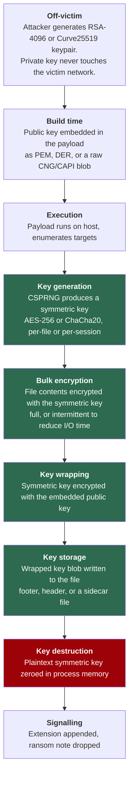

# Evil Encryption Academy


> A structured path from "I don't know what AES is" to "I can find the AES key in this memory dump and tell the client which files are recoverable."

Companion repository to [Malware-Analysis-Academy](https://github.com/IronBranded/Malware-Analysis-Academy).

---

## What this is

Ransomware is, at its core, an applied cryptography problem wearing a Windows costume. Most people responding to a ransomware incident have never been taught the cryptography, so they cannot answer the two questions that actually matter to the victim:

1. **Is any of this recoverable?**
2. **How do we prove what happened and stop it happening again?**

This repository teaches the cryptography, the Windows internals it runs on, and the forensic artifacts it leaves, in that order.

## What this is not

This repository does not contain ransomware, ransomware source code, or build-ready components of one. There is no encryptor proof-of-concept, no file-traversal-and-target-selection routine, no backup-destruction implementation, and no evasion tooling.

That is a deliberate design decision, not an oversight, and [`SCOPE.md`](SCOPE.md) sets out the reasoning and the exact omissions. The short version: an incident responder never needs to write an encryptor, and the read-side skills are the ones that are actually scarce. Every offensive mechanic in this curriculum is taught from the direction a defender meets it — as an import table, an entropy profile, a journal entry, a structure in RAM.

## Who this is for

| Audience | Start at |
|---|---|
| Complete beginner, no crypto background | [`00-Foundations/`](00-Foundations/), then [`01/labs/`](01-Symmetric-Cryptography/labs/) to watch encryption happen |
| SOC analyst who can read logs but not binaries | [`00-Foundations/03-entropy-analysis/`](00-Foundations/) then [`08-Triage-and-IR/`](09-Triage-and-IR/) |
| DFIR practitioner, needs the crypto | [`02-Hybrid-Encryption-Model/`](02-Hybrid-Encryption-Model/) |
| Reverse engineer, needs the ransomware specifics | [`02-Hybrid-Encryption-Model/`](02-Hybrid-Encryption-Model/) then [`07-Reverse-Engineering/`](08-Reverse-Engineering/) |
| Responder mid-incident, needs an answer now | [`10-Recovery-and-Decryption/01-is-it-recoverable/`](10-Recovery-and-Decryption/) |

## Quickstart

Three commands, no malware, about two minutes. This is the fastest way to see whether the repository is useful to you.

```bash
pip install -r tools/requirements.txt

# 1. Watch encryption happen, and see why ECB is broken
python3 01-Symmetric-Cryptography/labs/encryption_demo.py modes

# 2. Generate safe specimens and triage them
python3 01-Symmetric-Cryptography/labs/encryption_demo.py specimens --outdir ./lab-samples
python3 02-Hybrid-Encryption-Model/labs/parse_footer.py ./lab-samples --recurse

# 3. Recover data from a partially encrypted file, with no key
python3 10-Recovery-and-Decryption/labs/recover_partial.py ./lab-samples/invoice.xlsx.intermittent
```

Step 1 shows the same image before and after AES-ECB. Each 16-byte block is drawn as one shade keyed to its contents, so identical blocks get identical shades:

```
PLAINTEXT BLOCKS                     AES-256-ECB  <-- shape leaks through
        ████████████%%%%%%%%%%%%             ++++++++++++################
        ++++++++++++++++++++++++             ++++++++++++%%%%%%%%%%%%%%%%
        ============████████████             ++++++++++++    @@@@@@@@@@@@
%%%%%%%%@@@@@@@@@@@@········::::             ------------%%%%%%@@@@@@%%%%

    distinct 16-byte blocks, ECB:  15 of 128
    distinct 16-byte blocks, CBC: 128 of 128
```

ECB scores 6.68 entropy and is still completely broken. High entropy does not mean secure — one of several misconceptions collected in [`MYTHS.md`](MYTHS.md).

Step 3 extracts surviving plaintext from a partially encrypted file without any key:

```
REGION MAP
  █······························██······························█
  █ encrypted    · surviving plaintext

  encrypted         189,580 bytes  (  0.9%)
  RECOVERABLE    20,864,000 bytes  ( 99.1%)
```

When you want the full exercise, the [**capstone**](capstone/) generates a complete synthetic incident and grades your recoverability assessment against an answer key.

## Prerequisites

**Required**

- Comfortable in a Windows command line and PowerShell
- Basic Python reading ability (you do not need to write it well)
- A hypervisor and the discipline to use snapshots

**Helpful, not required**

- Any exposure to x86-64 assembly
- Prior use of Ghidra, x64dbg, or Volatility
- The first four chapters of *Practical Malware Analysis*

**Do not skip:** [`labs/SAFE_LAB_SETUP.md`](labs/SAFE_LAB_SETUP.md). Several modules reference live malware samples. An isolated, snapshotted, network-severed VM is not optional.

---

## The Ransomware Hybrid Encryption Lifecycle

Nearly every modern family implements some variant of this. Understanding it is the spine of the entire curriculum.



**The green band is the recovery window.** Between key generation and key destruction, the plaintext symmetric key exists in RAM on a machine you control. After step H it does not, and the only copy that can open the file is wrapped under a private key sitting on infrastructure you will never touch.

This is why memory acquisition beats almost every other response action, and why "we rebooted it to be safe" is the sentence that ends a recovery.

### Where the defender gets leverage

| Lifecycle stage | Artifact you can actually collect | Module |
|---|---|---|
| Public key embedded at build time | PEM/DER/blob magic bytes in the PE; YARA-able | [`08-04`](08-Reverse-Engineering/) |
| Payload execution | Sysmon 1, Security 4688, prefetch, AmCache | [`09-02`](09-Triage-and-IR/) |
| Target enumeration | Directory access bursts, Security 4663, USN journal | [`09-01`](09-Triage-and-IR/) |
| Symmetric key in memory | **Expanded AES key schedule in process RAM** | [`07-03`](07-Memory-Forensics/) |
| Bulk encryption | Entropy profile per file; intermittent leaves gaps | [`03-01`](03-Encryption-Paradigms/) |
| Key wrapping | CNG/CAPI import profile; constant hunting if statically linked | [`02`](02-Hybrid-Encryption-Model/) |
| Wrapped blob on disk | Fixed-size high-entropy tail matching an RSA modulus size | [`02/labs/parse_footer.py`](02-Hybrid-Encryption-Model/labs/parse_footer.py) |
| Anti-recovery behavior | Service creation 7045, log clear 1102, backup tooling invocation | [`03-04`](03-Encryption-Paradigms/) |
| Signalling | Note filenames, extension patterns, `$MFT` rename records | [`09-03`](09-Triage-and-IR/) |

---

## Module Index

| # | Module | You will be able to | Status |
|---|---|---|---|
| 00 | [**Foundations**](00-Foundations/) | Tell encoding, hashing, and encryption apart; read an entropy score correctly | ✅ written |
| 01 | [**Symmetric Cryptography**](01-Symmetric-Cryptography/) | Recognize AES and ChaCha20 by their constants and API calls | ✅ written |
| 02 | [**Hybrid Encryption Model**](02-Hybrid-Encryption-Model/) | Explain why the file is locked, and identify the recovery window | ✅ written |
| 03 | [**Encryption Paradigms**](03-Encryption-Paradigms/) | Distinguish full from intermittent encryption from ciphertext alone | ✅ written |
| 04 | [**Platform & LOTL Encryption**](04-Platform-And-LOTL-Encryption/) | Detect BitLocker/EFS abuse where there is no malware to reverse | ✅ written |
| 05 | [**Windows Crypto Internals**](05-Windows-Crypto-Internals/) | Trace key material from API call to heap allocation to KSP | ✅ written |
| 06 | [**Case Studies**](06-Case-Studies/) | Read a threat-intel report and extract the crypto scheme from it | ✅ [2 written](06-Case-Studies/), ongoing |
| 07 | [**Memory Forensics**](07-Memory-Forensics/) | Recover a symmetric key from a RAM image and validate it | ✅ written |
| 08 | [**Reverse Engineering**](08-Reverse-Engineering/) | Locate the crypto routine and embedded public key in a sample | ✅ written |
| 09 | [**Triage and IR**](09-Triage-and-IR/) | Build a defensible timeline of an encryption event | ✅ written |
| 10 | [**Recovery and Decryption**](10-Recovery-and-Decryption/) | Give the client an evidence-backed recoverability verdict | ✅ written |
| 11 | [**Endpoint Detection**](11-Endpoint-Detection/) | Explain how EDR catches ransomware, and where it doesn't | ✅ written |

Plus the [**capstone**](capstone/) — a generated incident with a graded answer key, which exercises every module and every tool at once.

All twelve modules are written; two carry planned expansions noted on the page with their outline of record — nothing here is a dead link. Contributions welcome; see [`CONTRIBUTING.md`](CONTRIBUTING.md).

### Available now, regardless of module status

| | |
|---|---|
| [**FIRST-60-MINUTES.md**](FIRST-60-MINUTES.md) | Live-incident runbook, ordered by evidence volatility |
| [**MYTHS.md**](MYTHS.md) | Common misconceptions that cost victims data |
| [`references/CIPHER-IDENTIFICATION.md`](references/CIPHER-IDENTIFICATION.md) | Every algorithm observed in ransomware + identifying constants |
| [`references/PRIMARY_SOURCES.md`](references/PRIMARY_SOURCES.md) | MSTIC ransomware feed indexed against modules |
| [`tools/identify_crypto.py`](tools/identify_crypto.py) | Algorithm identification by constants, APIs, container magics |
| [`02-.../labs/parse_footer.py`](02-Hybrid-Encryption-Model/labs/parse_footer.py) | Encrypted-file triage: paradigm, footer, format reconciliation |
| [`01-.../labs/encryption_demo.py`](01-Symmetric-Cryptography/labs/encryption_demo.py) | See encryption happen; generate safe lab specimens |
| [`10-.../labs/recover_partial.py`](10-Recovery-and-Decryption/labs/recover_partial.py) | Extract surviving plaintext from partially encrypted files |
| [`11-.../labs/canary_deploy.py`](11-Endpoint-Detection/labs/canary_deploy.py) | Deploy and verify decoy files; exit 1 on trip, for monitoring |
| [`09-.../templates/`](09-Triage-and-IR/templates/) | Client-facing recoverability assessment template |
| **Detection rules** | [YARA](01-Symmetric-Cryptography/yara/) in modules 01/02/04, [Sigma](11-Endpoint-Detection/sigma/) in module 11 |
| [**`capstone/`**](capstone/) | Generated incident + graded answer key. Start here once you've read Module 02 |
| [`tools/README.md`](tools/README.md) | How the five tools chain together in an incident |
| [`GLOSSARY.md`](GLOSSARY.md) | Every term used here, written for first encounter |
| [`SCOPE.md`](SCOPE.md) | What this repository contains and deliberately omits |
| [`labs/SAFE_LAB_SETUP.md`](labs/SAFE_LAB_SETUP.md) | **Mandatory before handling any live sample** |

**Reference:** [`references/CIPHER-IDENTIFICATION.md`](references/CIPHER-IDENTIFICATION.md) catalogs every algorithm observed in ransomware with its identifying constants, and [`tools/identify_crypto.py`](tools/identify_crypto.py) automates the matching. [`references/PRIMARY_SOURCES.md`](references/PRIMARY_SOURCES.md) indexes the MSTIC ransomware feed against the modules it supports.

**Worked case study:** [The Gentlemen (Storm-2697)](06-Case-Studies/the-gentlemen/) — per-file ephemeral Curve25519 + XChaCha20, and the case that exposed a blind spot in our own footer triage.

**Suggested path:** 00 → 01 → 02 → 03 → 04 → 11 → 06 → 09 → 07 → 08 → 10 → 05

Module 02 is the hinge and Module 07 is its payoff — read those two together even if you skip others. Module 05 is placed last deliberately; the internals make far more sense once you have watched the APIs get used.

## Testing

The tooling is covered by regression tests. Every test exists because a real bug shipped.

```bash
pip install -r tools/requirements.txt
python -m unittest discover tests -v
```

---

## Reference material

### Primary threat intelligence

- **[Microsoft Security Blog — Ransomware](https://www.microsoft.com/en-us/security/blog/threat-intelligence/ransomware/)** — the anchor feed for this curriculum. MSTIC publishes full encryptor teardowns including cryptographic scheme, footer layout, and hunting queries. Indexed and mapped to modules in [`references/PRIMARY_SOURCES.md`](references/PRIMARY_SOURCES.md)
- [CISA #StopRansomware advisories](https://www.cisa.gov/stopransomware) — joint advisories with per-family IOC sets
- [The DFIR Report](https://thedfirreport.com/) — full intrusion timelines with artifact-level detail
- [No More Ransom](https://www.nomoreransom.org/) — decryptor availability, and the reference point for "is this recoverable"

### Microsoft API documentation

- Cryptography Next Generation (CNG) reference — `BCrypt*` and `NCrypt*` primitives
- CryptoAPI (CAPI) reference — legacy `Crypt*` surface, still seen in older families
- Restart Manager, VSS, and Windows Thread Pool docs — read these as artifact sources

### Training

- **SANS FOR610** — Reverse-Engineering Malware. The closest formal analogue to modules 01, 02, and 07.
- **SANS FOR508** — Advanced Incident Response, Threat Hunting and Digital Forensics. Underpins modules 06 and 08.
- **SANS FOR500** — Windows Forensic Analysis. Artifact grounding for module 08.
- **SANS FOR498** — Digital Acquisition. Directly relevant to the acquisition doctrine in module 06.
- **SANS FOR509** — Enterprise Cloud Forensics. For incidents that cross into cloud storage and identity.
- **[13cubed](https://www.13cubed.com/)** — free YouTube material on Windows triage, memory forensics, `$UsnJrnl` and `$MFT` analysis. Start here if the SANS price tag is out of reach.

### Books

- *Windows Internals, Part 1 & 2* — Yosifovich, Russinovich, Solomon, Ionescu
- *Practical Malware Analysis* — Sikorski & Honig
- *Learning Malware Analysis* — Monnappa K A
- *The Art of Memory Forensics* — Ligh, Case, Levy, Walters
- *Serious Cryptography* — Aumasson, for the cryptography itself

---

## Contributing

Contributions are welcome. Read [CONTRIBUTING.md](CONTRIBUTING.md) first.

Pull requests adding encryptor code, target-selection logic, anti-recovery implementations, or evasion techniques will be closed without merge. Detection content, analysis tooling, decryption and recovery tooling, case studies grounded in primary sources, and corrections are all wanted.

## License

Documentation under MIT. Lab tooling is individually licensed; check each `labs/` directory.
